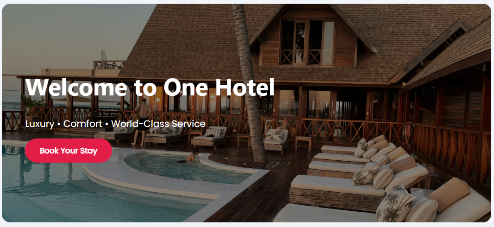
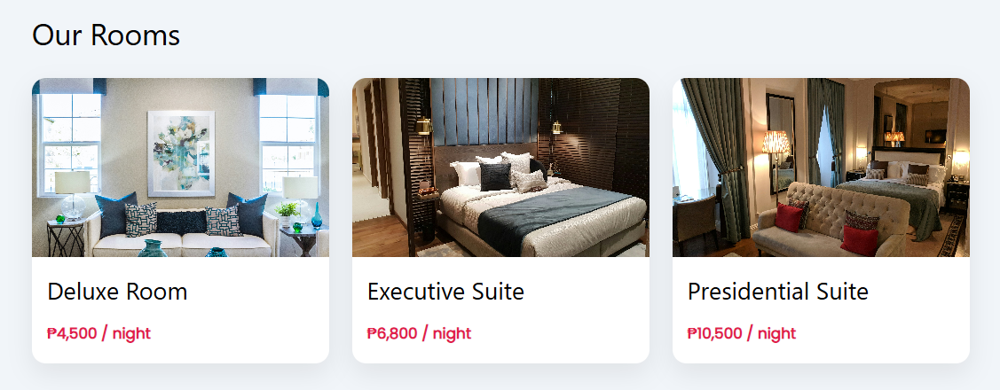
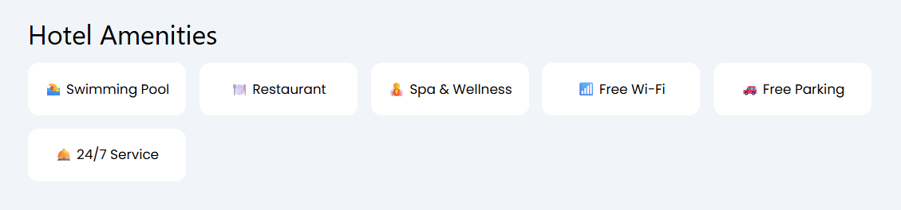

# 🏨 ONE Hotel – Booking Website Homepage

ONE Hotel is a modern and responsive hotel booking website homepage designed to showcase luxury, comfort, and world-class service. This project focuses on clean UI, intuitive navigation, and visually appealing sections suitable for a real-world hotel reservation system.

---

## 📸 Preview

### 🏠 Homepage Hero Section



### 🛏️ Rooms Showcase



### 🌟 Hotel Amenities



### 📂 Sidebar Navigation


---

## ✨ Features

- Elegant hotel homepage layout
- Collapsible sidebar navigation
- Hero banner with call-to-action
- Rooms showcase with images and pricing
- Hotel amenities section
- Clean and modern design
- Responsive layout for desktop and mobile
- Easy to customize and extend

---

## 🛠️ Built With

- HTML5
- CSS3
- W3.CSS
- Google Fonts (Poppins, Montserrat)

---

## 📂 Project Structure

```text
ONE-Hotel/
├── assets/
│   └── images/
├── home.html
├── dashboard.html
├── faq.html
├── about.html
├── style.css
└── README.md
```
